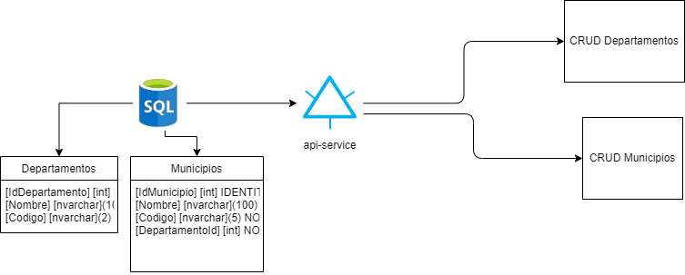

# DevTest

Proyecto "Prueba técnica" para Homini

# Desarrollado por

Alejandro Castro Agudelo - alejoagu26@gmail.com

# Instrucciones

[Aquí](./recursos/doc/prueba-tecnica.pdf) encontrarás la prueba técnica

# Propuesta de solución

# Base de datos

[Aquí](./recursos/sql/scriptbasedatos.sql) encontrarás el script para la creación de la base de datos

# Backend

Para ejecutar el proyecto se deben seguir los siguientes pasos
- Actualizar el appsettings.json con la conexión a la base de datos
- Se utilizó desarrollo code first, para usar el proyecto se puede ejecutar el script de base de datos o se puede crear la migración

      add-migration MigracionInicial
- Actualizar base de datos

      update-database
- Compilar el proyecto y ejecutarlo
